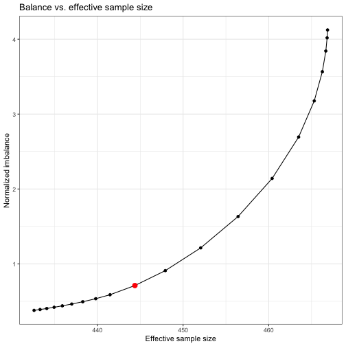

# `multical`: Multilevel calibration weighting for surveys

## Installation
You can install `multical` from github using `devtools`.


```r
## Install devtools if not already installed
install.packages("devtools", repos='http://cran.us.r-project.org')
## Install multical from github
devtools::install_github("ebenmichael/multical")
```


## Data

`multical` takes two separate data frames as inputs:

- **`sample_data`**: individual-level data for survey respondents. One row per respondent.
- **`pop_data`**: data describing the target population. This can be individual-level (one row per population member) or pre-aggregated to the cell level (one row per unique combination of covariate values, with a column giving the count per cell).

We'll use two contrived examples shipped with the package: `data_individual` has individual-level information on covariates, response, and outcome; `data_cell` has cell-level information.


```r
library(multical)
library(dplyr)
#> 
#> Attaching package: 'dplyr'
#> The following objects are masked from 'package:stats':
#> 
#>     filter, lag
#> The following objects are masked from 'package:base':
#> 
#>     intersect, setdiff, setequal, union
data(data_individual)
data(data_cell)
```

`data_individual` records 4 covariates, whether each individual responded (`response`) to the survey, whether they are in the target population (`intarget`), and their answer to a binary question `y`.


```r
head(data_individual)
#>   X1 X2 X3 X4 response intarget y
#> 1  3  2  2  4        1        1 0
#> 2  2  2  2  4        1        1 0
#> 3  1  1  2  1        1        1 1
#> 4  3  1  1  4        1        1 0
#> 5  2  2  1  1        1        1 0
#> 6  1  1  1  1        1        1 1
```

`data_cell` records each unique combination of the 4 covariates, the number of respondents in that cell (`sample_count`), the number of individuals in the target population in that cell (`target_count`), and the mean outcome in the cell.


```r
head(data_cell)
#> # A tibble: 6 × 7
#>   X1    X2    X3    X4    sample_count target_count     y
#>   <fct> <fct> <fct> <fct>        <dbl>        <dbl> <dbl>
#> 1 1     1     1     1                8           50 0.42 
#> 2 1     1     1     2                5           21 0.810
#> 3 1     1     1     3                2           17 0.765
#> 4 1     1     1     4               33          281 0.530
#> 5 1     1     2     1               10           29 0.552
#> 6 1     1     2     2                9           23 0.565
```

For the examples below we'll split `data_individual` into respondents (our sample) and the full population.


```r
sample_ind <- data_individual %>% filter(response == 1)
pop_ind    <- data_individual   # all rows; each counts as 1 population member
```


## Getting multilevel calibration weights

The main function is `multical`. Its first three arguments are:

1. `formula`: a **right-hand-side only** formula (`~ covariates`) specifying which variables to calibrate on
2. `sample_data`: the respondent data frame
3. `pop_data`: the population data frame (individual or cell level)

An optional `target_count` argument names a column in `pop_data` giving the count or weight per row. When omitted, each row of `pop_data` is treated as one population member.

### Raking on first-order margins (individual-level population)

Setting `order = 1` calibrates only on the main-effect margins of each covariate.


```r
out <- multical(~ X1 + X2 + X3 + X4, sample_ind, pop_ind, order = 1)
out
#> A multical object
#> Formula : ~X1 + X2 + X3 + X4
#> Order   : 1 
#> Respondents : 500 
#> Lambda values: 1 
#> Lambda : 0 
#> Use weights() to extract respondent weights, get_balance() to assess calibration.
```

`multical` returns a `multical` object. The key fields are:

- `out$weights`: matrix of calibration weights (one column per lambda value, one row per respondent, in the same order as `sample_data`)
- `out$cells`: data frame of covariate values plus `sample_count`, `target_count`, and `base_weight` for every unit (respondents and any pop-only cells)
- `out$lambda`: the lambda values used

Call `weights(out)` to extract respondent weights at the auto-selected default lambda.

We can inspect marginal balance using `get_balance`:


```r
get_balance(out, 1)
#>    lambda term    difference
#> 1       0  X11 -1.792114e-11
#> 2       0  X12 -2.996280e-12
#> 3       0  X13  2.091541e-11
#> 4       0  X22  6.848733e-11
#> 5       0  X23  1.248037e-10
#> 6       0  X24  4.920461e-11
#> 7       0  X32  1.282576e-10
#> 8       0  X42  4.822429e-11
#> 9       0  X43 -1.099640e-11
#> 10      0  X44  8.450233e-11
```

To estimate the population mean of an outcome, use the `estimate()` function
(defaults to the linearized estimator — see the [Estimating population means](#estimating-population-means-with-estimate) section below for all options):


```r
estimate(out, y, data = sample_ind)
#>   estimate         se     method lambda
#> 1 0.539679 0.02291384 linearized      0
```

### Higher-order calibration with a fixed lambda

Setting `order > 1` includes interaction terms up to that order. The parameter `lambda` controls the trade-off between exact post-stratification (small `lambda`) and lower variance (large `lambda`).


```r
out <- multical(~ X1 + X2 + X3 + X4, sample_ind, pop_ind, order = 4, lambda = 1)

rbind(head(get_balance(out, 4)), tail(get_balance(out, 4)))
#>     lambda            term    difference
#> 1        1             X11  1.563083e-11
#> 2        1             X12  1.950679e-11
#> 3        1             X13 -3.514009e-11
#> 4        1             X22 -5.916079e-11
#> 5        1             X23 -1.039975e-10
#> 6        1             X24  2.656954e-11
#> 104      1 X12:X22:X32:X44 -2.355217e-04
#> 105      1 X13:X22:X32:X44 -1.255785e-03
#> 106      1 X12:X23:X32:X44  1.505367e-03
#> 107      1 X13:X23:X32:X44  8.009261e-04
#> 108      1 X12:X24:X32:X44 -1.809410e-03
#> 109      1 X13:X24:X32:X44  5.229173e-04
```

### Selecting lambda automatically

By default (no `lambda` supplied), `multical` solves over a grid of values from `lambda_max` down to `lambda_max * lambda_min_ratio`. Use `get_balance_v_sample_size` to trace the balance-effective-sample-size trade-off and choose an appropriate value.


```r
out <- multical(~ X1 + X2 + X3 + X4, sample_ind, pop_ind)

# plot() shows the balance vs. effective-sample-size trade-off and
# highlights the auto-selected default lambda in red
plot(out)
```



By default, the `weights()` function will extract the weights corresponding to the value of `lambda` that achieves 95% of the total possible balance gain. You can override this by either (i) supplying a specific index to choose from (e.g. `weights(out, lambda_idx = 2)` returns weights corresponding to `out$lambda[2]`) or (ii) supplying a specific balance threshold (e.g. `weights(out, balance_threshold = 0.90)` returns weights that give at least 90% of the total possible balance gain).

For large datasets with many covariates, start with a low `order` and increase as needed — the number of interaction terms grows quickly.

### Using pre-aggregated cell-level population data

If the population is available as a pre-aggregated cell table (e.g. from a census), pass it as `pop_data` and name the count column via `target_count`. The sample is still individual-level.


```r
out <- multical(~ X1 + X2 + X3 + X4, sample_ind, data_cell,
                target_count = target_count,
                order = 4, lambda = 1)
```

Estimation works the same way (using the default linearized estimator):


```r
estimate(out, y, data = sample_ind)
#>    estimate         se     method lambda
#> 1 0.5323389 0.02374401 linearized      1
```


## Estimating population means with `estimate()`

The `estimate()` function computes a population mean estimate and a
linearization-based standard error from a fitted `multical` object. The
`method` argument selects the estimator:

| Method | Description |
|--------|-------------|
| `"linearized"` (default) | Point estimate is the weighted mean. Standard errors are the residuals of an OLS or ridge regression of the outcome on interactions up to the specified order. |
| `"hajek"` | Point estimate is the weighted mean. Standard error is the standard sandwich standard error.|
| `"greg"` | GREG estimator; uses OLS/ridge regression for model assistance to reduce bias. Standard errors are based off the residuals of the regression |
| `"drp"` | Double regression and post-stratification; the same implementation as `"greg"` but uses cross-fitted gradient-boosted trees (xgboost) for the outcome model. |

All methods return a one-row data frame with columns `estimate`, `se`, `lambda`,
and `method`.


```r
out <- multical(~ X1 + X2 + X3 + X4, sample_ind, pop_ind, order = 4)
```

### Linearized estimator (default)

The default. Fits a first-order OLS model of `y` on the covariate design matrix
and uses the residuals in the sandwich SE formula.


```r
estimate(out, y, data = sample_ind)
#>   estimate         se     method    lambda
#> 1 0.531562 0.02377138 linearized 0.7247596
```

### Hajek estimator

Returns the calibration-weighted mean of `y` and a  standard sandwich SE,
without any regression adjustment.


```r
estimate(out, y, data = sample_ind, method = "hajek")
#>   estimate         se method    lambda
#> 1 0.531562 0.02394727  hajek 0.7247596
```

### GREG estimator

The GREG estimator uses cross-fitted ridge regression predictions on the target
population to form the point estimate. The interaction order is inherited from
the `multical` object.


```r
estimate(out, y, data = sample_ind, method = "greg")
#>    estimate         se method    lambda
#> 1 0.5328709 0.02397813   greg 0.7247596
```

### DRP estimator

The double regression and post-stratification (DRP) estimator replaces the parametric regression
with cross-fitted gradient-boosted trees (xgboost). Additional arguments
(e.g. `nrounds`, `eta`) are forwarded directly to `xgboost`.


```r
estimate(out, y, data = sample_ind, method = "drp", nrounds = 200)
#>    estimate         se method    lambda
#> 1 0.5251385 0.02656333    drp 0.7247596
```

### Selecting lambda

By default `estimate()` uses the auto-selected default lambda (the one that
achieves at least 95% of the possible balance gain). You can override this with
`lambda_idx` (an integer index into `out$lambda`) or `balance_threshold` (a
value in (0, 1) that re-runs lambda selection):


```r
# use the weights at index 5 in the lambda grid
estimate(out, y, data = sample_ind, lambda_idx = 5)
#>    estimate         se     method   lambda
#> 1 0.5335186 0.02345171 linearized 8.181361

# re-select lambda targeting 95% balance gain
estimate(out, y, data = sample_ind, balance_threshold = 0.95)
#>   estimate         se     method    lambda
#> 1 0.531562 0.02377138 linearized 0.7247596
```

### Subsetting respondents

The `subset` argument restricts estimation to a subset of respondents without
refitting the calibration weights. Pass either a logical vector (one entry per
respondent, `TRUE` to retain) or an integer index vector.


```r
# Estimate on respondents where a covariate equals a specific value
mask <- sample_ind$X1 == levels(sample_ind$X1)[1]
estimate(out, y, data = sample_ind, subset = mask)
#>    estimate         se     method    lambda
#> 1 0.5358512 0.03725474 linearized 0.7247596

# Integer index version
estimate(out, y, data = sample_ind, subset = which(mask))
#>    estimate         se     method    lambda
#> 1 0.5358512 0.03725474 linearized 0.7247596
```

If any retained respondent has a missing outcome (`NA`), those observations are
automatically excluded and a warning is issued. Respondents excluded by `subset`
are never checked for `NA`.
