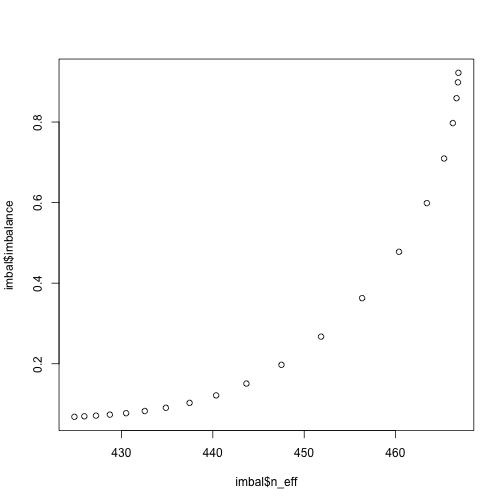

# `multical`: Multilevel calibration weighting for surveys

## Installation
You can install `multical` from github using `devtools`.


```r
## Install devtools if noy already installed
install.packages("devtools", repos='http://cran.us.r-project.org')
## Install augsynth from github
devtools::install_github("ebenmichael/multical")
```


## Data
To show how to use `multical`, we'll use two contrived data examples. One, `data_individual`, has individual-level information on covariates, response, and outcome, while the other, `data_cell`, has cell-level information.

```r
library(multical)
library(dplyr)
#> 
#> Attaching package: 'dplyr'
#> The following objects are masked from 'package:stats':
#> 
#>     filter, lag
#> The following objects are masked from 'package:base':
#> 
#>     intersect, setdiff, setequal, union
data(data_individual)
data(data_cell)
```

Each data set has the same 4 covariates, but `data_individual` records whether each individual responded `response` to the survey, and how they answered a binary question `y`.


```r
head(data_individual)
#>   X1 X2 X3 X4 response intarget y
#> 1  3  2  2  4        1        1 0
#> 2  2  2  2  4        1        1 0
#> 3  1  1  2  1        1        1 1
#> 4  3  1  1  4        1        1 0
#> 5  2  2  1  1        1        1 0
#> 6  1  1  1  1        1        1 1
```

On the other hand, `data_cell` records each individual combination of the covariates, the number of respondents in that cell, the number of individuals in the target population in that cell, and the mean outcome in the cell.


```r

head(data_cell)
#> # A tibble: 6 x 7
#>   X1    X2    X3    X4    sample_count target_count     y
#>   <fct> <fct> <fct> <fct>        <dbl>        <dbl> <dbl>
#> 1 1     1     1     1                8           50 0.42 
#> 2 1     1     1     2                5           21 0.810
#> 3 1     1     1     3                2           17 0.765
#> 4 1     1     1     4               33          281 0.530
#> 5 1     1     2     1               10           29 0.552
#> 6 1     1     2     2                9           23 0.565
```


## Getting multilevel calibration weights

To compute the multilevel calibration weights for both cases, we use the `multical` function. For individual-level data, we give a formula `response ~ covariates`, and an indicator for whether an individual is in the target population (in this case everyone is). We also tell `multical` what order of interactions to consider,.
For instance, if we only want to rake on the first order margins, we set `order = 1`.


```r
out <- multical(response ~ X1 + X2 + X3 + X4, intarget, data_individual, order = 1)
```

We can see the difference between the re-weighted sample and the population via the `get_imbalance` function:

```r
get_balance(out, 1)
#> # A tibble: 10 x 3
#>    lambda term   difference
#>     <dbl> <chr>       <dbl>
#>  1      0 X11   0.00000188 
#>  2      0 X12   0.00000152 
#>  3      0 X13   0.000000781
#>  4      0 X22   0.00000190 
#>  5      0 X23   0.000000392
#>  6      0 X24   0.000000411
#>  7      0 X32   0.00000210 
#>  8      0 X42   0.000000281
#>  9      0 X43   0.000000306
#> 10      0 X44   0.00000312
```

To estimate the population average with individual level data, we can join the output with our data and take the weighted average

```r
inner_join(data_individual, out) %>%
  filter(response == 1) %>%
  summarise(sum(weight * y) / sum(weight))
#> Joining, by = c("X1", "X2", "X3", "X4")
#>   sum(weight * y)/sum(weight)
#> 1                   0.5422783
```

If we want to include higher order interaction terms, we can increase `order` and give a hyper-parameter `lambda` that controls the degree of approximate post-stratification.

```r
out <- multical(response ~ X1 + X2 + X3 + X4, intarget, data_individual, order = 4, lambda = 1)

rbind(head(get_balance(out, 4)), tail(get_balance(out, 4)))
#> # A tibble: 12 x 3
#>    lambda term             difference
#>     <dbl> <chr>                 <dbl>
#>  1      1 X11              0.0000546 
#>  2      1 X12              0.0000458 
#>  3      1 X13              0.0000242 
#>  4      1 X22              0.0000562 
#>  5      1 X23              0.00000688
#>  6      1 X24              0.0000145 
#>  7      1 X12:X22:X32:X44 -0.178     
#>  8      1 X13:X22:X32:X44 -2.36      
#>  9      1 X12:X23:X32:X44  4.34      
#> 10      1 X13:X23:X32:X44  1.84      
#> 11      1 X12:X24:X32:X44 -6.79      
#> 12      1 X13:X24:X32:X44  1.45
```

By default, `multical` uses all higher order interactions. For large datasets this may be prohibitively computational expensive! So consider starting with a low order and increasing for large datasets. If no value of `lambda` is provided, `multical` solves for a series of different hyper-parameter values. We can use the `get_balance_v_sample_size` function to trace out the trade-off between better balance and lower effective sample sizes.

```r
out <- multical(response ~ X1 + X2 + X3 + X4, intarget, data_individual)

imbal <- get_balance_v_sample_size(out, 4)
plot(imbal$n_eff, imbal$imbalance)
```




For cell-level data, almost everything is the same. However, now we use the sample and population counts rather than indicators for response and being in the target population.

```r
out <- multical(sample_count ~ X1 + X2 + X3 + X4, target_count, data_cell, order = 4, lambda = 1)
```
Note: the output data frame `out` may have the cells in a different order than in the input data frame. Be sure to join the output  with the original data frame on the variables to map the weights to the data accurately. We can then estimate the population average with the weights and sample counts.


```r
left_join(data_cell, out) %>%
  summarise(sum(weight * sample_count * y) / sum(target_count))
#> Joining, by = c("X1", "X2", "X3", "X4", "sample_count", "target_count")
#> # A tibble: 1 x 1
#>   `sum(weight * sample_count * y)/sum(target_count)`
#>                                                <dbl>
#> 1                                              0.515
```
